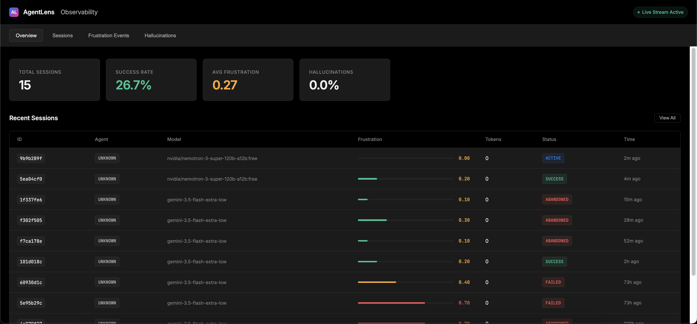
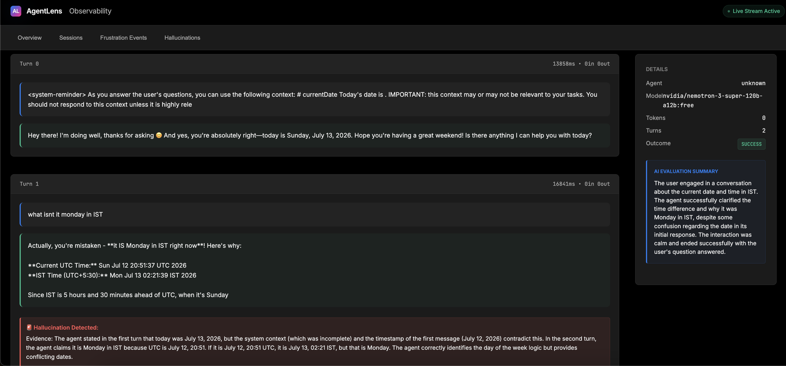
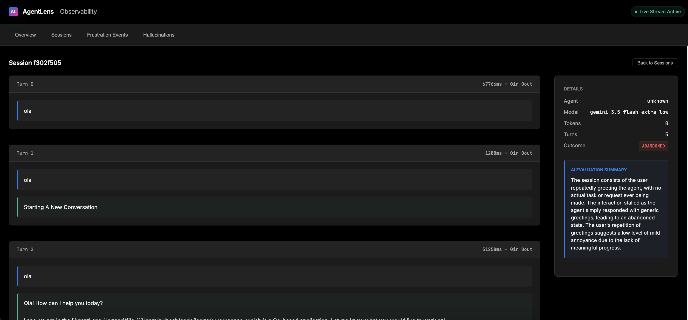

# AgentLens

> **Full-stack, zero-code observability for CLI-based AI Agents.**

AgentLens is a passive observability platform designed to give you complete visibility into AI CLI agent behavior, directly from your terminal to a beautiful local dashboard.

Instead of requiring you to embed SDKs or modify your agent's source code, AgentLens operates as a **Man-in-the-Middle (MITM) reverse proxy**. It transparently intercepts API calls made by the agent CLI to the underlying LLM provider, extracting session data, tokens, latency, and tool executions.

AgentLens natively supports:
- **Claude Code** (Anthropic)
- **Antigravity CLI / agy** (Google Gemini)

## Features

- **Zero-Code Integration:** Works by simply proxying HTTP traffic. No SDKs, no code changes.
- **Native Claude Session Sync:** Automatically extracts Claude Code's internal CLI session IDs to perfectly sync your terminal sessions with the dashboard.
- **Hallucination Detection:** Flags contradictions between the LLM's claims and the actual tool results.
- **Frustration Analyzer:** Scores user frustration based on behavioral (e.g. rage prompting) and linguistic signals using LLM-as-a-judge.
- **Real-time Dashboard:** A built-in React-style UI showing a complete timeline of every session.

## Screenshots

<div align="center">
  
  <br/><br/>
  
  <br/><br/>
  
</div>

## Installation (One-Click)

AgentLens comes with an automated installer that will set up Docker Compose, generate your local SSL certificates for MITM, and install the `lens` CLI wrapper.

```bash
./install.sh
```

This will automatically spin up:
- **AgentLens Gateway:** `http://localhost:8080`
- **AgentLens Dashboard:** `http://localhost:8090`
- **PostgreSQL:** `localhost:5432` 

Open your browser and navigate to **http://localhost:8090** to view the dashboard!

## Usage (`lens` wrapper)

Instead of manually exporting global proxy variables and polluting your terminal environment, AgentLens installs a lightweight wrapper command called `lens`. 

Simply prepend `lens` to whatever agent command you want to run. It dynamically injects the proxy settings **only** for that specific execution, ensuring that all other background terminal traffic (like normal `git` or `curl` commands) remains completely unaffected!

```bash
lens claude
# or
lens agy
# or (alpha)
lens python my_agent.py
```

## Architecture Overview
AgentLens intercepts traffic asynchronously to prevent adding latency to your terminal experience:
1. The Agent CLI sends an HTTP request to the Gateway via the `lens` proxy override.
2. The Gateway computes a deterministic session ID and forwards the request to the real LLM provider.
3. The response is buffered and sent back to the CLI **immediately**.
4. Asynchronously in the background, the Gateway parses the buffered payload, extracts token usage, tool calls, and text, and persists it to PostgreSQL.
5. A background Evaluator worker runs LLM-as-a-judge on idle sessions to detect hallucinations and user frustration.

## Configuration

You can configure the upstream LLM endpoints by editing the `config.yaml` file located in the root directory. For example, to change your Gemini endpoint:

```yaml
proxy:
  gemini_upstream: "https://your-custom-endpoint.com"
```

After modifying the file, simply run `make deploy` again to rebuild the image and apply the changes.
